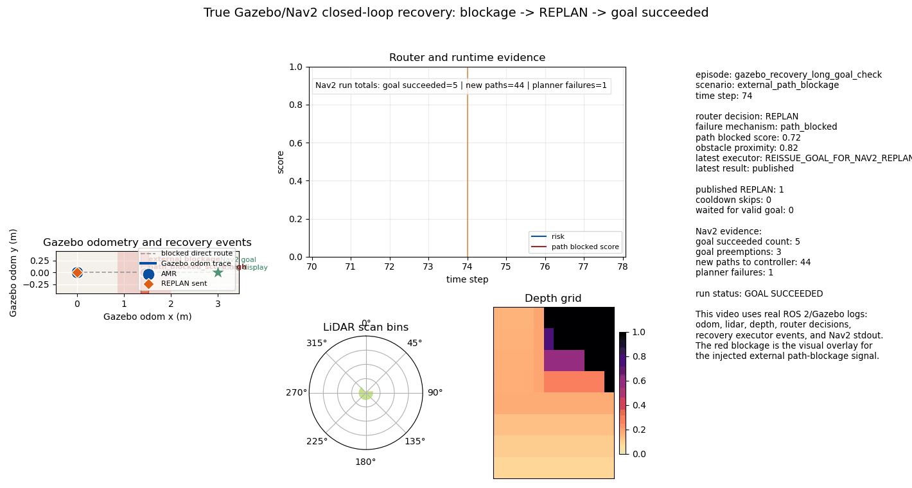
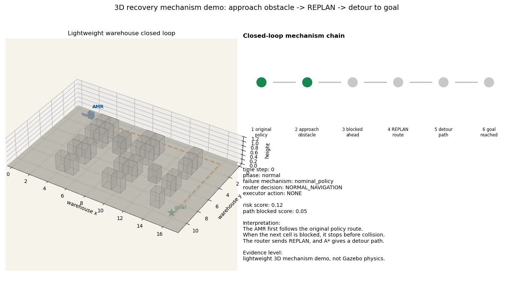

# Mechanism-Aware AMR Runtime Reliability Routing

This repository is a research prototype for autonomous mobile robot (AMR)
runtime reliability under simulated warehouse disturbances. The central
question is not whether a robot can follow a path in a clean environment. The
project asks:

```text
When a learned navigation policy makes a confident wrong decision,
what kind of failure produced that error, and which recovery route should handle it?
```

The project follows a mechanism-aware structure:

```text
Gazebo/Nav2 episodes
  -> scan and depth observations
  -> Nav2-plan expert action labels
  -> supervised navigation policy
  -> high-confidence residual error analysis
  -> failure-mechanism diagnosis
  -> route-specific recovery
  -> Nav2-facing recovery execution evidence
```

> Research prototype only. This repository is not a certified robot safety
> system, is not validated on a real robot, and must not be used for hardware
> deployment without separate engineering validation.

## For Supervisors: Read These First

This repository preserves the full research trail. For a fast review, start
with these files:

1. [Project narrative](docs/AMR_RELIABILITY_PROJECT_NARRATIVE.md): the full
   story from simulation data to policy learning and recovery routing.
2. [Depth/fusion formal results](docs/GAZEBO_DEPTH_FUSION_FORMAL_V1_RESULTS.md):
   the scan, depth, and scan+depth policy comparison.
3. [Residual route ablation results](docs/GAZEBO_POLICY_RESIDUAL_ROUTE_ABLATION_RESULTS.md):
   how high-confidence policy errors are mapped to recovery-route families.
4. [Visualization gallery](visualizations/README.md): curated GIFs, figures,
   and compact evidence tables for presentation.

Current status: the project has completed a simulation-grounded policy-learning
and residual-routing prototype. It also includes a longer Gazebo/Nav2
closed-loop recovery validation run showing that `REPLAN` route decisions can be
translated into Nav2 goal reissue actions while the AMR moves through the
warehouse scene. The next step is a multi-seed recovery-success benchmark.

## Protocol Guard: What This Project Does And Does Not Claim

The project separates four layers so that the evidence does not become circular:

- **Simulation/data layer:** Gazebo/Nav2 episodes generate sensor observations,
  planner traces, and expert movement labels.
- **Policy layer:** supervised models learn from scan, depth, or scan+depth
  observations to predict navigation actions.
- **Mechanism layer:** residual errors are inspected after policy training,
  especially high-confidence mistakes.
- **Recovery layer:** error mechanisms are routed to recovery families such as
  `REPLAN`, `RELOCALIZE`, `CAUTIOUS_MODE`, `HUMAN_REVIEW`, or `SAFE_STOP`.

The current evidence supports a mechanism-aware research prototype. It does
not yet prove real-robot safety, statistically robust recovery success, or
deployment readiness.

## Research Story

The project is organized as a sequence of controlled questions:

```text
1. Runtime reliability demo
   -> show that AMR failures are not one generic failure type

2. Gazebo/Nav2 simulation scaffold
   -> generate repeatable episodes with external disturbance, sensor streams,
      robot state, and planner traces

3. Expert-labeled policy dataset
   -> use Nav2 plan information as supervised action labels

4. Policy learning and modality ablation
   -> compare scan-only, depth-only, and scan+depth policies

5. Residual mechanism analysis
   -> inspect confident policy errors and identify structured mechanisms

6. Recovery-route mapping
   -> assign different mechanisms to different recovery families

7. Recovery executor and Gazebo/Nav2 closed-loop validation
   -> connect route decisions to Nav2-facing actions and verify one
      route-triggered recovery episode with Nav2 goal success
```

The main contribution is therefore the **policy-failure-to-recovery evidence
chain**:

```text
simulated disturbance
  -> learned policy decision
  -> confident residual error
  -> diagnosed failure mechanism
  -> mechanism-specific recovery route
  -> runtime execution bridge
```

The recovery executor is important, but the current evidence should still be
read as a single-run prototype validation rather than a statistically validated
recovery controller.

## 1. Problem Definition: AMR Failures Are Not One Failure Type

A warehouse AMR may fail for several different reasons:

| Failure source | Example symptom | Appropriate recovery family |
| --- | --- | --- |
| External blockage | Planned route is blocked by a moving obstacle. | `REPLAN` |
| Localization uncertainty | Pose estimate becomes unreliable. | `RELOCALIZE` |
| Perception degradation | Lidar/depth observations become noisy or incomplete. | `CAUTIOUS_MODE` or `HUMAN_REVIEW` |
| Execution deviation | Robot drifts away from intended trajectory. | `REPLAN` |
| Planner instability | Replanning repeatedly fails. | `SAFE_STOP` |

This motivates mechanism-specific routing instead of one generic fallback.

The lightweight warehouse demo makes this interface explicit:

| Component | Role |
| --- | --- |
| `WarehouseEnvironment` | Controllable warehouse layout with shelves and obstacles. |
| `FailureInjector` | Creates blockage, drift, sensor degradation, target shift, and replanning failure. |
| `ReliabilitySupervisor` | Converts runtime signals into a risk score. |
| `DecisionRouter` | Routes risk patterns to recovery actions. |

Visual evidence:


Evidence tables:

- [baseline_log.csv](visualizations/evidence/runtime_demo/baseline_log.csv)
- [supervisor_log.csv](visualizations/evidence/runtime_demo/supervisor_log.csv)
- [comparison_summary.csv](visualizations/evidence/runtime_demo/comparison_summary.csv)

## 2. Simulation And Dataset: Why Gazebo/Nav2 Is Needed

The grid demo explains the mechanism idea, but it cannot support policy
learning evidence. The project therefore builds a ROS 2 / Gazebo / Nav2
benchmark that records:

- robot pose and goal context;
- Nav2 plan-derived expert actions;
- lidar scan observations;
- depth-image grid observations;
- external disturbance signals;
- runtime route decisions.

The formal Gazebo/Nav2 scan-depth matrix completed:

| Item | Setting |
| --- | --- |
| Simulator | Gazebo + Nav2 |
| Episodes | 36 / 36 completed |
| Seeds | 10, 16, 18 |
| Split rule | seed 10 train, seed 16 validation, seed 18 test |
| Goals | `east_south`, `west_near`, `north_near`, `south_axis` |
| Scenarios | `nominal`, `external_path_blockage`, `perception_degradation` |
| Labels | Nav2-plan expert actions |

Key implementation files:

| File | Role |
| --- | --- |
| `ros2_ws/src/amr_reliability_benchmark/worlds/reliability_room.sdf` | Warehouse-style Gazebo world. |
| `ros2_ws/src/amr_reliability_benchmark/models/reliability_amr/model.sdf` | AMR model with lidar and depth camera. |
| `ros2_ws/src/amr_reliability_benchmark/launch/gazebo_nav2_benchmark.launch.py` | Gazebo/Nav2 benchmark launch entry. |
| `ros2_ws/src/amr_reliability_benchmark/amr_reliability_benchmark/gazebo_fault_injector.py` | External disturbance and signal degradation. |
| `ros2_ws/src/amr_reliability_benchmark/amr_reliability_benchmark/scan_policy_observation_recorder.py` | Lidar-policy dataset recorder. |
| `ros2_ws/src/amr_reliability_benchmark/amr_reliability_benchmark/depth_policy_observation_recorder.py` | Depth-policy dataset recorder. |

Full protocol:

- [Gazebo fault dataset model protocol](docs/GAZEBO_FAULT_DATASET_MODEL_PROTOCOL.md)
- [Simulation dataset protocol](docs/SIMULATION_DATASET_PROTOCOL.md)
- [Gazebo validation matrix results](docs/GAZEBO_VALIDATION_MATRIX_RESULTS.md)

## 3. Policy Learning: How The Robot Learns Actions

The policy is trained by supervised learning. It is not currently trained by
reinforcement learning.

At each timestep, the recorder aligns the observation with the movement
direction implied by the Nav2 plan. The action labels are:

```text
NORTH, SOUTH, EAST, WEST
```

`STAY` is treated as a safety or recovery outcome rather than an ordinary
expert navigation action.

The policy variants test different observation sources:

| Policy | Input | Why tested |
| --- | --- | --- |
| Scan-only | lidar bins + goal/context | Common AMR navigation signal. |
| Depth-only | depth grid + goal/context | Adds forward spatial structure. |
| Scan+depth fusion | lidar + depth + goal/context | Tests whether simple multimodal fusion improves reliability. |

Training entry points:

- `experiments/train_gazebo_scan_policy.py`
- `experiments/train_gazebo_depth_policy.py`
- `experiments/train_gazebo_fusion_policy.py`

## 4. Policy Ablation: What Improved And What Failed

The held-out test comparison suggests that depth adds useful information, but
simple fusion is not automatically better.

| Modality/model | Accuracy | Macro F1 | Weighted F1 | ECE | High-confidence errors |
| --- | ---: | ---: | ---: | ---: | ---: |
| depth baseline | 0.8773 | 0.6666 | 0.8819 | 0.0553 | 62 |
| scan baseline | 0.8694 | 0.6741 | 0.8776 | 0.0778 | 78 |
| scan+depth baseline | 0.8641 | 0.6559 | 0.8673 | 0.0721 | 64 |
| scan focal | 0.8076 | 0.6343 | 0.8235 | 0.0617 | 51 |
| scan+depth focal | 0.8111 | 0.6318 | 0.8265 | 0.0549 | 52 |

Interpretation:

- Depth baseline has the best held-out accuracy, weighted F1, ECE, and fewer
  high-confidence errors than scan-only.
- Scan-only retains the best macro F1 among baseline models, so it remains
  relevant for action balance.
- Simple scan+depth concatenation does not outperform the best single-modality
  baseline.
- Focal loss reduces high-confidence errors, but the accuracy drop is too large
  to treat it as the final policy upgrade.

Visual evidence:


Evidence:

- [modality_ablation_metrics.csv](visualizations/evidence/policy_routes/modality_ablation_metrics.csv)
- [test_ablation_delta_vs_scan_baseline.csv](visualizations/evidence/policy_routes/test_ablation_delta_vs_scan_baseline.csv)
- [Depth/fusion formal results](docs/GAZEBO_DEPTH_FUSION_FORMAL_V1_RESULTS.md)

## 5. What The Policy Sees: Sensor-Policy Playback

The repository includes reconstructed GIFs from a held-out Gazebo/Nav2 episode.
They are generated from recorded CSV features, not from manual animation.

Selected playback episode:

```text
scenario = external_path_blockage
goal = east_south
seed = 18
```

Visual evidence:


Source manifest:

- [sensor_policy_visualization_manifest.csv](visualizations/sensor_policy/sensor_policy_visualization_manifest.csv)

Generation code:

- `experiments/generate_sensor_policy_visualizations.py`

## 6. Mechanism Diagnosis: Why The Policy Is Wrong

The key question is not only which model has the best aggregate score. The
project asks whether confident mistakes are structured.

Dominant held-out high-confidence residuals include:

| Scenario | Error pattern | Mechanism interpretation | Proposed route |
| --- | --- | --- | --- |
| `perception_degradation` | `SOUTH -> EAST` | perception axis confusion | `CAUTIOUS_REPLAN` |
| `external_path_blockage` | `EAST -> SOUTH` | blocked-path direction error | `REPLAN` |
| `external_path_blockage` | `WEST -> SOUTH` | blocked-path direction error | `REPLAN` |
| boundary-like nominal cases | `NORTH <-> WEST` | directional boundary uncertainty | `CAUTIOUS_MODE` |

This is the mechanism layer: policy errors are not treated as random noise or
one undifferentiated "bad action." They are assigned interpretable failure
families.

Visual evidence:


Evidence:

- [high_conf_error_patterns.csv](visualizations/evidence/policy_routes/high_conf_error_patterns.csv)
- [residual_mechanism_summary.csv](visualizations/evidence/policy_routes/residual_mechanism_summary.csv)
- [scenario_error_summary.csv](visualizations/evidence/policy_routes/scenario_error_summary.csv)

## 7. Recovery Routing: From Mechanism To Action

After the residual mechanisms are identified, the project maps them to recovery
families.

| Residual mechanism | Recovery route |
| --- | --- |
| `perception_axis_confusion` | `CAUTIOUS_REPLAN` |
| `perception_lateral_depth_confusion` | `CAUTIOUS_REPLAN` |
| `perception_degradation_confusion` | `CAUTIOUS_REPLAN` |
| `blocked_path_high_conf_direction_error` | `REPLAN` |
| `blocked_path_direction_error` | `REPLAN` |
| `localization_state_error` | `RELOCALIZE` |
| `boundary_direction_confusion` | `CAUTIOUS_MODE` |
| `geometric_policy_residual` | `HUMAN_REVIEW` |

High-confidence test error coverage:

| Modality/model | High-confidence errors | Actionable route coverage |
| --- | ---: | ---: |
| depth baseline | 62 | 1.000 |
| fusion baseline | 64 | 0.984 |
| fusion focal | 52 | 1.000 |
| scan baseline | 78 | 1.000 |
| scan focal | 51 | 1.000 |

This shows that high-confidence residual errors can be assigned to meaningful
route families. It does not, by itself, prove that each route will succeed in
closed-loop control.

Visual evidence:


Evidence:

- [recovery_route_evidence.csv](visualizations/evidence/policy_routes/recovery_route_evidence.csv)
- [recovery_route_coverage.csv](visualizations/evidence/policy_routes/recovery_route_coverage.csv)
- [residual_route_report.json](visualizations/evidence/policy_routes/residual_route_report.json)

## 8. Runtime Execution: From Route Label To Nav2 Action

The project now includes a conservative ROS 2 recovery executor:

```text
/amr_reliability/router_decision
  -> recovery_executor
  -> /goal_pose for REPLAN
  -> /initialpose for RELOCALIZE
  -> /amr_reliability/recovery_execution event log
```

The executor does not publish raw velocity commands and does not bypass Nav2.
It only sends messages that the navigation stack already understands.

| Route | Executor behavior | Current status |
| --- | --- | --- |
| `REPLAN` | Reissues the current `/goal_pose` so Nav2 can replan. | Implemented and validated in one Gazebo/Nav2 run. |
| `RELOCALIZE` | Publishes a pose estimate to `/initialpose`. | Implemented, needs expanded episodes. |
| `CAUTIOUS_MODE` | Records the route for a downstream cautious controller. | Logged only. |
| `HUMAN_REVIEW` | Records the operator-review route. | Logged only. |
| `SAFE_STOP` | Records the stop route for a downstream controller. | Logged only. |

Gazebo/Nav2 recovery-success validation evidence:

| Evidence item | Value |
| --- | ---: |
| Routed episode rows | 479 |
| Recovery-executor rows | 479 |
| Published `REPLAN` goal reissues | 7 |
| Nav2 goal succeeded messages | 5 |
| Nav2 goal preemption messages | 3 |
| New paths passed to controller | 44 |
| Failed-to-make-progress messages | 2 |
| Planner failures observed | 1 |



Supported claim: in one longer external-blockage Gazebo/Nav2 validation run,
route-triggered `REPLAN` was executed, the AMR moved through the warehouse
scene, and Nav2 reported goal success. This is the first true ROS2/Gazebo
closed-loop recovery video in the repository. It is not yet a multi-seed
recovery benchmark.

Entry points:

- `ros2_ws/src/amr_reliability_benchmark/amr_reliability_benchmark/recovery_executor.py`
- `ros2_ws/src/amr_reliability_benchmark/launch/nav2_runtime_pipeline.launch.py`
- `experiments/generate_gazebo_recovery_success_video.py`
- `experiments/generate_gazebo_recovery_3d_video.py`

Launch flag:

```powershell
enable_recovery_executor:=true
```

For presentation, the recovery videos are intentionally ordered as a research
process:

| Step | Video | What it shows |
| --- | --- | --- |
| 1 | `closed_loop_replan_recovery_demo.gif` | Conceptual route logic: blocked original route, route decision, replanned path. |
| 2 | `closed_loop_recovery_supervisor_story.gif` | Readable lightweight story for supervisors: blockage, diagnosis, `REPLAN`, recovered path, goal reached. |
| 3 | `closed_loop_recovery_mechanism_3d.gif` | 3D mechanism demo: the AMR approaches the obstacle, stops before the blocked segment, sends `REPLAN`, and follows a detour to the goal. |
| 4 | `gazebo_nav2_recovery_success_episode.gif` | True Gazebo/Nav2 closed-loop evidence: lidar, depth, route decision, executor events, movement, and Nav2 goal success. |
| 5 | `gazebo_nav2_recovery_success_3d.gif` | 3D presentation view reconstructed from Gazebo/Nav2 logs: scaled AMR body, warehouse shelf boundaries, visualized blockage signal, lidar rays, depth grid, and recovery events. |


The 3D mechanism demo is the clearest recovery-story explanation. It shows the
behavior expected from a physical blockage scenario: approach the obstacle,
stop before the blocked segment, replan, and detour.



The Gazebo/Nav2 videos are stronger ROS2/Gazebo evidence because they are
reconstructed from real Gazebo/Nav2 logs rather than the lightweight simulator.


The Gazebo 3D reconstruction is kept as a supplemental artifact because it makes
AMR odometry, shelf boundaries, lidar/depth observations, route decisions, and
recovery events visible in one view. It should not be read as a raw Gazebo GUI
screen recording or a collision-physics obstacle demo.

## Claim-To-Evidence Index

| Claim | Evidence | Source |
| --- | --- | --- |
| AMR failures should not be treated as one generic failure. | Runtime supervisor and router separate blockage, localization, perception, replanning, and stagnation signals. | `src/reliability_supervisor.py`, `src/decision_router.py`, runtime visualizations |
| Gazebo/Nav2 can generate policy-learning episodes. | 36/36 formal episodes completed with synchronized scan/depth/policy logs. | `docs/GAZEBO_DEPTH_FUSION_FORMAL_V1_RESULTS.md` |
| Nav2 can provide expert action labels. | Episode recorders align sensor observations with Nav2 plan-derived movement labels. | `scan_policy_observation_recorder.py`, `depth_policy_observation_recorder.py` |
| Depth adds useful reliability evidence. | Depth baseline has the best held-out accuracy, weighted F1, ECE, and fewer high-confidence errors than scan-only. | `visualizations/evidence/policy_routes/modality_ablation_metrics.csv` |
| Simple scan+depth fusion is not enough. | Fusion baseline does not outperform the best single-modality baseline. | `docs/GAZEBO_DEPTH_FUSION_FORMAL_V1_RESULTS.md` |
| Policy errors are structured. | High-confidence residuals concentrate in perception axis confusion and blocked-path direction errors. | `visualizations/evidence/policy_routes/high_conf_error_patterns.csv` |
| Recovery routes can be mechanism-specific. | Residual mechanisms map to `CAUTIOUS_REPLAN`, `REPLAN`, `RELOCALIZE`, `CAUTIOUS_MODE`, and `HUMAN_REVIEW`. | `visualizations/evidence/policy_routes/recovery_route_evidence.csv` |
| Recovery routes can be connected to Nav2-facing actions. | `recovery_executor` translates `REPLAN` into `/goal_pose` reissue and `RELOCALIZE` into `/initialpose`; the long validation run recorded 7 published `REPLAN` goal reissues. | `visualizations/gazebo_closed_loop/gazebo_nav2_recovery_success_summary.csv` |
| A recovery story can be visualized end to end for presentation. | The supervisor-facing and 3D mechanism videos show blockage, diagnosis, `REPLAN`, replanned route, and goal reached in the lightweight simulator. | `visualizations/recovery_route/closed_loop_recovery_supervisor_story.gif`, `visualizations/recovery_route/closed_loop_recovery_mechanism_3d.gif`, `visualizations/recovery_route/closed_loop_recovery_mechanism_3d_manifest.csv` |
| One ROS2/Gazebo closed-loop recovery validation run reaches goal success. | The longer external-blockage episode recorded 7 published `REPLAN` goal reissues, 44 new paths to controller, 5 Nav2 goal-succeeded messages, and visible movement through the warehouse scene. | `visualizations/gazebo_closed_loop/gazebo_nav2_recovery_success_episode.gif`, `visualizations/gazebo_closed_loop/gazebo_nav2_recovery_success_summary.csv` |
| The Gazebo/Nav2 recovery run can be presented as a 3D scene. | A 3D visualization reconstructs the AMR body, shelf boundaries, visualized blockage signal, lidar rays, depth grid, and recovery markers from the same Gazebo/Nav2 logs. The red blockage is a presentation overlay for the injected path-blockage signal, not a Gazebo collision object. | `visualizations/gazebo_closed_loop/gazebo_nav2_recovery_success_3d.gif`, `visualizations/gazebo_closed_loop/gazebo_nav2_recovery_success_3d_summary.csv` |

## Repository Map

```text
src/
  Lightweight warehouse reliability demo, supervisor, router, and visualization helpers

experiments/
  Dataset generation, Gazebo/Nav2 policy training, ablations, residual-route
  analysis, and visualization scripts

ros2_ws/
  ROS 2 / Gazebo / Nav2 package, robot model, world, launch files, recorders,
  runtime router, and recovery executor

docs/
  Research reports, protocols, formal result summaries, and narrative documents

visualizations/
  Curated GitHub-ready figures, GIFs, and compact evidence tables

outputs/
  Local raw/generated artifacts; intentionally ignored except .gitkeep
```

## Reproduce The Lightweight Demo

Install Python dependencies:

```powershell
pip install -r requirements.txt
```

Run the runtime reliability demo:

```powershell
python main.py
```

Run tests:

```powershell
python -m pytest tests
```

## Reproduce The Gazebo/Nav2 Pipeline

The Gazebo/Nav2 experiments require ROS 2 Jazzy, Gazebo, and Nav2.

Installation notes:

- `docs/INSTALL_ROS2_NAV2_GAZEBO_JAZZY.md`
- `ros2_ws/src/amr_reliability_benchmark/scripts/check_ros_stack.sh`
- `ros2_ws/src/amr_reliability_benchmark/scripts/install_jazzy_nav2_gazebo.sh`

Typical analysis commands:

```powershell
python experiments/train_gazebo_scan_policy.py
python experiments/train_gazebo_depth_policy.py
python experiments/train_gazebo_fusion_policy.py
python experiments/analyze_policy_residual_routes.py
```

Raw formal outputs are intentionally kept under `outputs/` and ignored by Git.
Curated figures and compact public evidence tables are under `visualizations/`.

## What Is Shown

The repository shows that:

- a simulation-grounded AMR reliability pipeline can be built around
  Gazebo/Nav2;
- Nav2 plans can provide expert labels for supervised policy learning;
- scan and depth observations can train navigation-action policies;
- depth improves several held-out reliability metrics in the current matrix;
- policy residual errors are structured by disturbance type;
- different residual mechanisms can be routed to different recovery families;
- `REPLAN` route decisions can be executed as Nav2 goal reissues in a headless
  Gazebo/Nav2 validation run;
- one longer external-blockage Gazebo/Nav2 recovery validation run reports Nav2
  goal success with lidar and depth logs;
- the recovery-success validation run can be visualized in 3D with the AMR body,
  visualized blockage signal, lidar rays, depth grid, and recovery markers;
- the recovery process can be shown as a readable closed-loop presentation
  video in the lightweight simulator.

## What Remains Unproven

The repository does not yet prove:

- real-world AMR safety;
- multi-seed stable closed-loop goal-reaching success after a recovery route is
  triggered;
- statistical robustness beyond the current limited seed matrix;
- a final best multimodal fusion architecture;
- full relocalization performance under expanded localization-drift episodes.

## Recommended Next Experiment

The next experiment should turn the single Gazebo/Nav2 recovery-success validation
run into a benchmark:

1. Run multiple `external_path_blockage`, `progress_blockage`, and
   `boundary_weak_blockage` Gazebo/Nav2 seeds with `enable_recovery_executor`.
2. Tune recovery timing, cooldowns, and goal handoff so `REPLAN` does not
   destabilize Nav2 through repeated preemption.
3. Measure goal success, time-to-recover, planner failures, and over-routing.
4. Add localization-drift episodes to validate the `RELOCALIZE` branch.
5. Compare rule-based, learned, uncertainty-threshold, and mechanism-aware
   route selectors.

## Limitations

- The evidence is simulation-grounded, not real-robot validation.
- The formal scan/depth/fusion comparison currently has one held-out test seed.
- The route layer is an evidence-backed prototype, not a proven closed-loop
  safety controller.
- The current Gazebo/Nav2 recovery-success evidence is one longer validation run,
  not a statistically robust benchmark.
- The supervisor-facing recovery video is a clear lightweight closed-loop
  demonstration, not a full Gazebo/Nav2 success benchmark.
- The 3D video is reconstructed from Gazebo/Nav2 logs; it is not a raw Gazebo
  GUI screen recording.
- Hardware-facing robot control is outside the scope of this repository.
