# AMR Reliability Visualization Gallery

This folder contains the curated visual evidence for the AMR runtime reliability
prototype. The raw experiment outputs remain in `outputs/`, while this folder
keeps the figures, GIFs, and compact evidence tables that are suitable for a
GitHub project page or supervisor presentation.

## Visual Story

```text
Runtime demo
-> risk supervision
-> baseline comparison
-> closed-loop recovery-route demonstration
-> Gazebo/Nav2 recovery executor smoke evidence
-> supervisor-facing closed-loop recovery story
-> scan/depth/fusion policy ablation
-> high-confidence residual errors
-> recovery-route distribution
```

## 1. Runtime AMR Demo

This GIF shows the lightweight warehouse simulation. The robot moves in a grid
environment with shelves, obstacles, target changes, path updates, risk scores,
and router decisions.

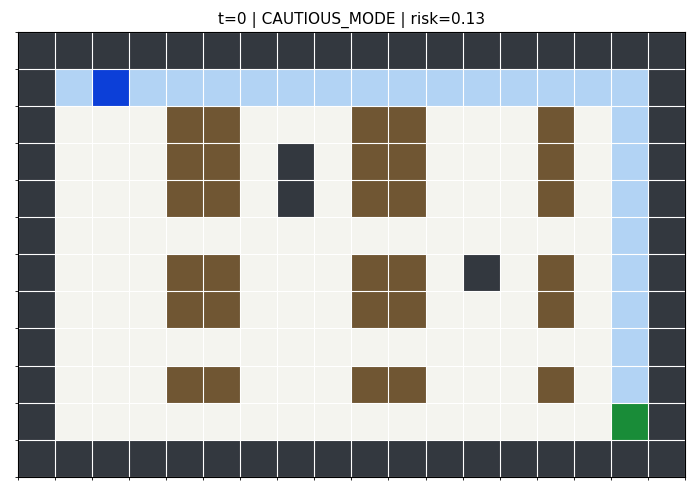

Source evidence:

- `evidence/runtime_demo/baseline_log.csv`
- `evidence/runtime_demo/supervisor_log.csv`
- `evidence/runtime_demo/comparison_summary.csv`

Generation code:

- `src/visualization.py`
- `main.py`

## 2. Runtime Risk Curve

This plot shows how the reliability supervisor turns runtime signals into a
risk score over time. The dashed thresholds mark cautious-mode and safe-stop
regions.

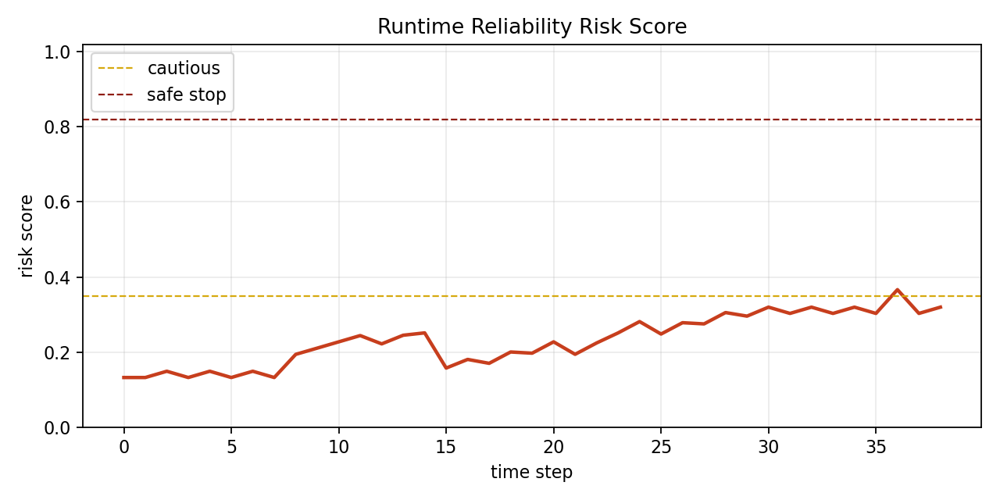

## 3. Baseline vs Reliability Supervisor

This chart compares the baseline run against the reliability-supervised run.
It is the simplest visual demonstration that the project is about runtime
decision routing, not only path planning.

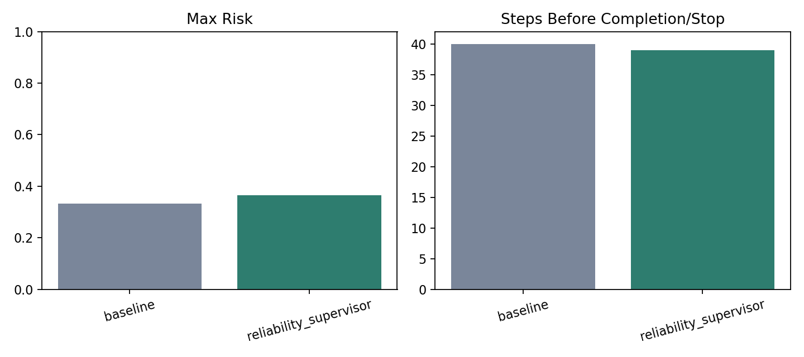

## 4. Gazebo Sensor-Policy Playback

These GIFs are reconstructed from recorded Gazebo/Nav2 episode CSV files. They
are not screen recordings of the Gazebo window. They show the actual sensor
features used by the policy pipeline: lidar scan bins, depth-grid cells, expert
action, predicted action, confidence, risk score, residual mechanism, and
recovery route.

The selected playback episode is an `external_path_blockage` test episode with
goal `east_south` and seed `18`.

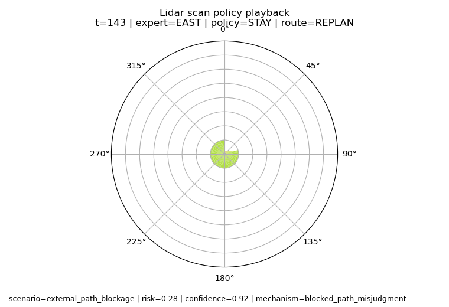

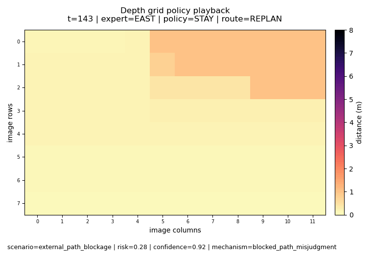

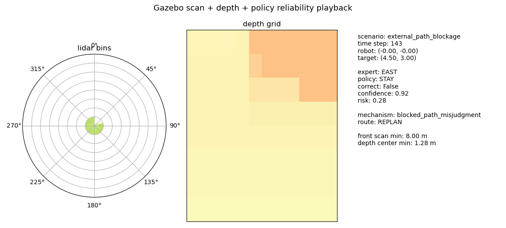

Source manifest:

- `sensor_policy/sensor_policy_visualization_manifest.csv`

Generation code:

- `experiments/generate_sensor_policy_visualizations.py`

## 5. Closed-Loop Recovery Route Playback

This GIF shows the recovery route concept that links the router to robot motion:
the original route becomes blocked, a lidar-style ray detects the blockage, the
router triggers `REPLAN`, and the AMR follows a new route back toward the goal.

This is a conceptual closed-loop playback generated from the lightweight
warehouse environment. It is not a Gazebo/Nav2 closed-loop recovery execution
recording.

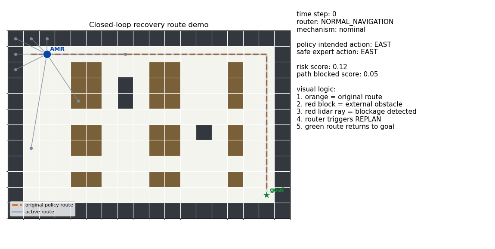

Source manifest:

- `recovery_route/recovery_route_visualization_manifest.csv`

Generation code:

- `experiments/generate_recovery_route_demo.py`

## 6. Gazebo/Nav2 Recovery Executor Playback

This GIF is reconstructed from a headless Gazebo/Nav2 run with
`enable_recovery_executor:=true`. It shows the actual route decisions,
recovery-executor events, lidar bins, odom trace, and Nav2 stdout evidence
from the smoke episode.

The supported claim is narrower than the conceptual GIF above: route decisions
are now connected to Nav2-facing recovery actions. The smoke run does not yet
prove successful goal-reaching after recovery.

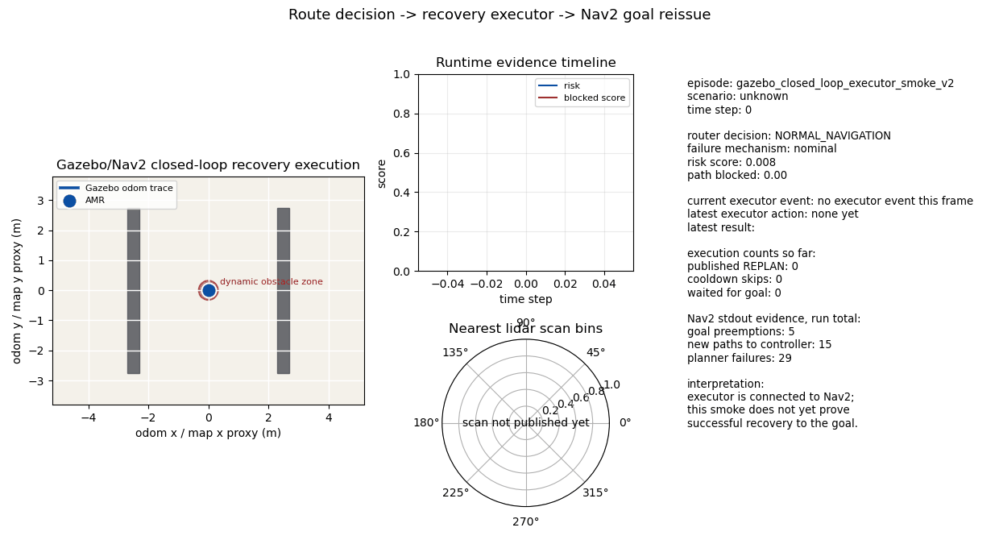

Source evidence:

- `gazebo_closed_loop/gazebo_nav2_closed_loop_recovery_summary.csv`
- `gazebo_closed_loop/gazebo_closed_loop_visualization_manifest.csv`

Generation code:

- `experiments/generate_gazebo_closed_loop_recovery_visualization.py`

## 7. Supervisor-Facing Closed-Loop Recovery Story

This is the short video intended for a quick supervisor presentation. It shows
the research process in one readable sequence: original policy route, external
blockage, failure-mechanism diagnosis, `REPLAN`, executor action, replanned
route, and goal reached.

It is generated from the lightweight warehouse closed-loop simulator so the
mechanism is visually clear. The Gazebo/Nav2 executor smoke evidence above is
kept immediately before it to show the step from route labels toward the
runtime navigation stack.

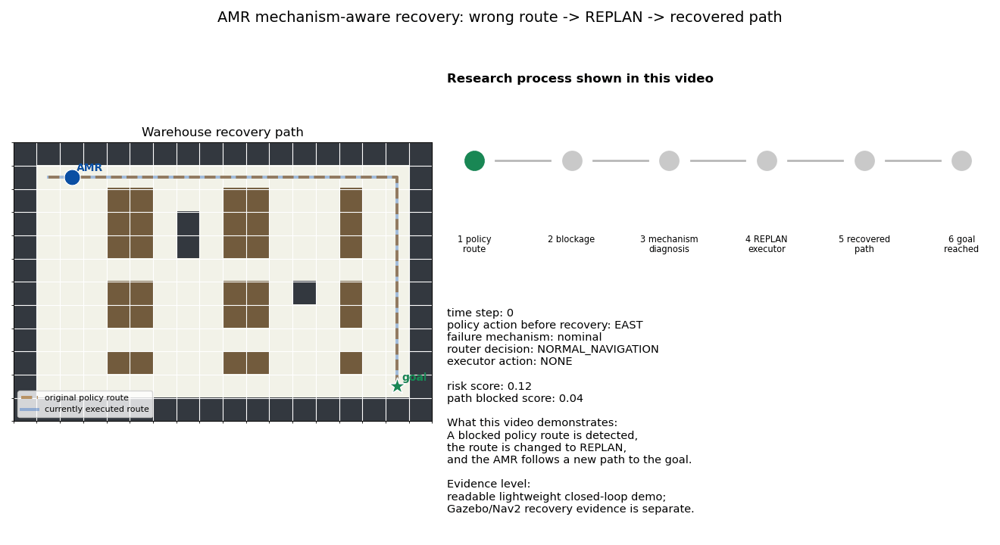

Source evidence:

- `recovery_route/supervisor_recovery_story_manifest.csv`

Generation code:

- `experiments/generate_supervisor_recovery_story_video.py`

## 8. Policy Accuracy By Modality

This figure summarizes the held-out test accuracy for the policy variants. The
comparison includes scan-only, depth-only, and scan+depth fusion policies.

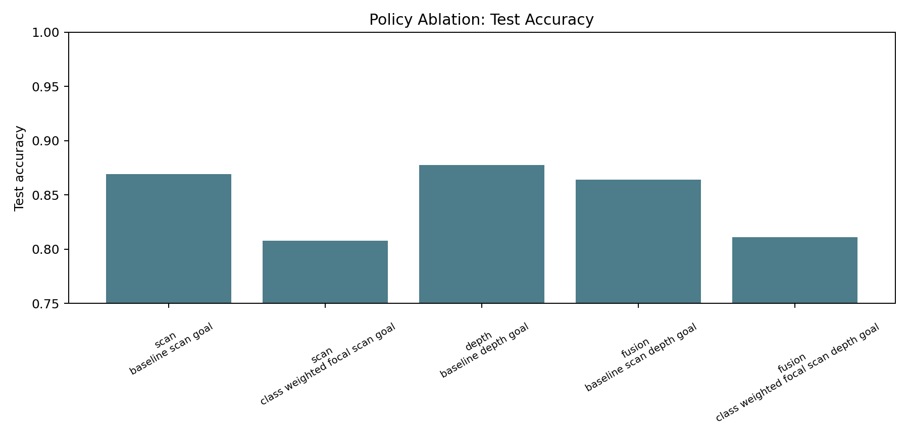

Source evidence:

- `evidence/policy_routes/modality_ablation_metrics.csv`
- `evidence/policy_routes/test_ablation_delta_vs_scan_baseline.csv`

Generation code:

- `experiments/train_gazebo_scan_policy.py`
- `experiments/train_gazebo_depth_policy.py`
- `experiments/train_gazebo_fusion_policy.py`
- `experiments/analyze_policy_residual_routes.py`

## 9. High-Confidence Policy Errors

This figure focuses on the residual errors that matter most for reliability:
cases where the learned policy is wrong while still confident. These errors are
used to identify policy failure mechanisms.

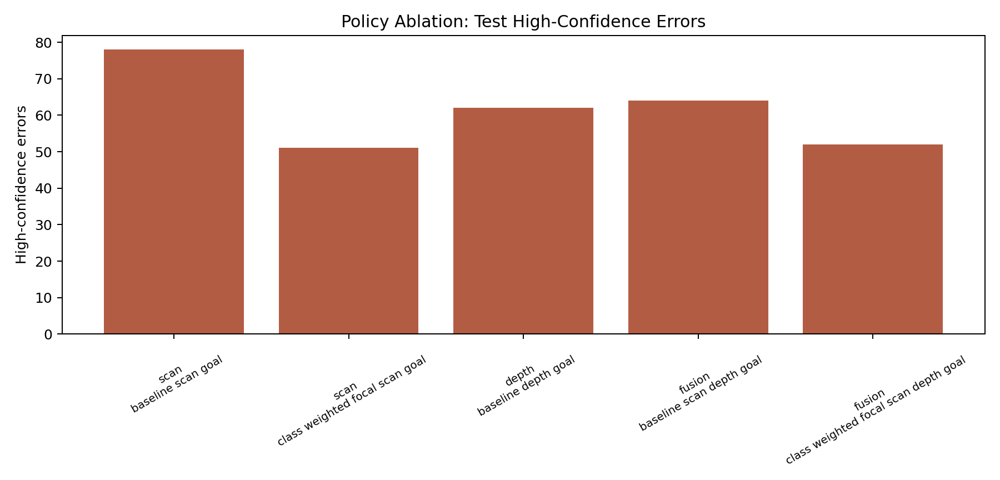

Source evidence:

- `evidence/policy_routes/high_conf_error_patterns.csv`
- `evidence/policy_routes/residual_mechanism_summary.csv`
- `evidence/policy_routes/scenario_error_summary.csv`

## 10. Recovery Route Distribution

This figure shows how high-confidence residual errors are assigned to recovery
families such as `CAUTIOUS_REPLAN`, `REPLAN`, `RELOCALIZE`, `CAUTIOUS_MODE`,
and `HUMAN_REVIEW`.

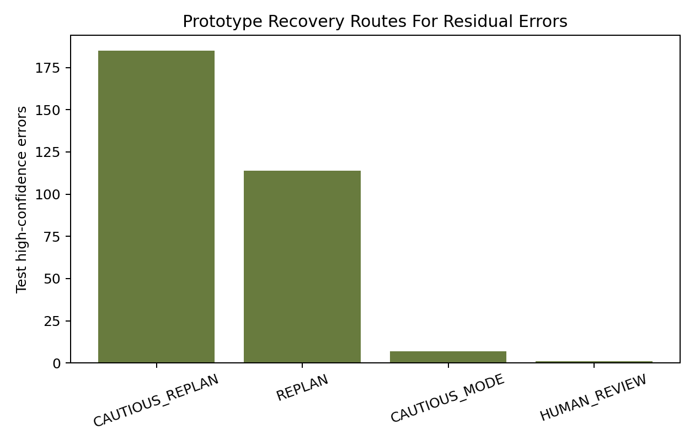

Source evidence:

- `evidence/policy_routes/recovery_route_evidence.csv`
- `evidence/policy_routes/recovery_route_coverage.csv`
- `evidence/policy_routes/residual_route_report.json`

## Interpretation

The main result is not only that one modality is more accurate than another.
The stronger research point is that policy errors are structured:

- perception degradation tends to produce axis-confusion errors;
- external path blockage produces high-confidence direction mistakes;
- those mechanisms can be routed to different recovery families.

This supports the project's ECG-style mechanism chain:

```text
train policy
-> inspect residual errors
-> identify failure mechanisms
-> build evidence-based recovery routes
```

## Current Limits

These figures are simulation-grounded evidence, not real-robot validation. The
formal Gazebo/Nav2 matrix currently uses one held-out test seed in the main
scan/depth/fusion comparison, so the results should be presented as a research
prototype rather than final statistical proof.
